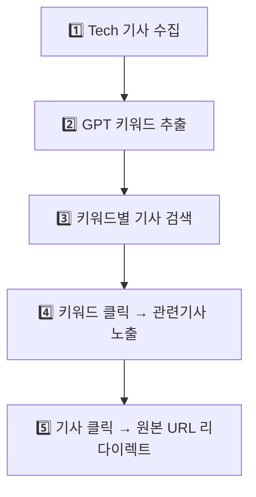

# 🚀 News GPT v2 - 새로운 워크플로우

> DeepSearch API와 GPT-4o를 활용한 실시간 뉴스 키워드 분석 플랫폼 (v2.0)

## 📋 새로운 구조 개요

### 🔄 워크플로우 (2025.07.20 업데이트)



## 🏗️ 시스템 아키텍처

### 1단계: Tech 기사 수집 (프론트와 연동)
- **URL**: `GET /api/keywords?start_date=2025-07-14&end_date=2025-07-18`
- **기능**: DeepSearch Tech 카테고리에서 날짜별 기사 수집
- **API**: `DEEPSEARCH_TECH_URL`

### 2단계: GPT 키워드 추출  
- **기능**: 수집된 기사들을 GPT-4o로 분석하여 핵심 키워드 추출
- **출력**: 상위 10개 키워드 (빈도수 포함)

### 3단계: 키워드별 기사 검색
- **기능**: 추출된 키워드를 다시 DeepSearch API로 던져서 관련 기사 수집  
- **API**: `DEEPSEARCH_KEYWORD_URL`

### 4단계: 키워드 클릭 → 관련기사 노출
- **URL**: `GET /api/keyword-articles/{keyword}?start_date=2025-07-14&end_date=2025-07-18`
- **기능**: 특정 키워드의 관련 기사들을 사용자에게 표시

### 5단계: 기사 클릭 → 원본 URL 리다이렉트
- **URL**: `GET /api/redirect/{article_id}`
- **기능**: 기사 클릭 시 원본 뉴스 사이트로 자동 리다이렉트

## 🔧 기술 스택

- **Backend**: FastAPI (Python)
- **AI**: Azure OpenAI GPT-4o
- **News API**: DeepSearch API v2
- **Storage**: 메모리 캐시 (Redis 추천)
- **Frontend**: HTML/JavaScript

## 🚀 빠른 시작

### 1. 환경 설정
```bash
# 가상환경 활성화
.\venv\Scripts\Activate.ps1

# 서버 시작
python main.py
```

### 2. 환경 변수 설정 (.env)
```env
AZURE_OPENAI_API_KEY=your_azure_openai_key
AZURE_OPENAI_ENDPOINT=your_azure_openai_endpoint  
DEEPSEARCH_API_KEY=your_deepsearch_api_key
```

### 3. DeepSearch URL 설정
`deepsearch_config.md` 파일을 참조하여 정확한 URL 설정 필요:
- `DEEPSEARCH_TECH_URL`: Tech 기사 수집용
- `DEEPSEARCH_KEYWORD_URL`: 키워드 기사 검색용

## 📖 API 엔드포인트

### 새로운 워크플로우 엔드포인트

| Method | URL | 설명 | 파라미터 |
|--------|-----|------|----------|
| GET | `/api/keywords` | Tech 기사 → 키워드 추출 | `start_date`, `end_date` |
| GET | `/api/keyword-articles/{keyword}` | 키워드별 관련 기사 | `keyword`, `start_date`, `end_date` |
| GET | `/api/redirect/{article_id}` | 원본 URL 리다이렉트 | `article_id` |

### 기존 호환성 엔드포인트

| Method | URL | 설명 |
|--------|-----|------|
| POST | `/chat` | AI 챗봇 |
| POST | `/keyword-analysis` | 키워드 분석 |
| GET | `/keyword-articles` | 레거시 키워드 검색 |

## 🧪 사용 예시

### 1. 주간 키워드 추출
```bash
curl "http://localhost:8000/api/keywords?start_date=2025-07-14&end_date=2025-07-18"
```

**응답:**
```json
{
  "keywords": [
    {"keyword": "인공지능", "count": 25, "rank": 1},
    {"keyword": "반도체", "count": 20, "rank": 2}
  ],
  "tech_articles_count": 50,
  "workflow": "Tech기사 → GPT키워드추출",
  "status": "success"
}
```

### 2. 키워드 관련 기사 검색
```bash
curl "http://localhost:8000/api/keyword-articles/인공지능?start_date=2025-07-14&end_date=2025-07-18"
```

**응답:**
```json
{
  "keyword": "인공지능",
  "articles": [
    {
      "id": "abc123def456",
      "title": "AI 기술 혁신 가속화",
      "content": "인공지능 기술이...",
      "url": "https://news.example.com/ai-news",
      "relevance_score": 15.0
    }
  ],
  "total_count": 12,
  "status": "success"
}
```

### 3. 원본 기사로 리다이렉트
```bash
curl "http://localhost:8000/api/redirect/abc123def456"
# → 자동으로 https://news.example.com/ai-news로 리다이렉트
```

## 🔧 설정 및 커스터마이징

### DeepSearch URL 설정
`main.py` 47-48줄에서 URL 수정:
```python
DEEPSEARCH_TECH_URL = "정확한_tech_url"
DEEPSEARCH_KEYWORD_URL = "정확한_keyword_search_url"  
```

### 키워드 추출 커스터마이징
`extract_keywords_with_gpt()` 함수에서 GPT 프롬프트 수정 가능

### 캐시 설정
현재는 메모리 캐시 사용, 운영환경에서는 Redis 권장:
```python
# main.py 184-185줄
articles_cache = {}  # Redis로 교체 권장
keywords_cache = {}  # Redis로 교체 권장
```

## 🚨 주의사항

1. **URL 설정 필수**: DeepSearch API URL이 정확히 설정되어야 함
2. **메모리 제한**: 현재 메모리 캐시 사용으로 서버 재시작시 데이터 손실
3. **API 제한**: DeepSearch API 호출 제한 고려 필요

## 📈 성능 및 모니터링

- **기사 수집**: Tech 카테고리에서 최대 100개
- **키워드 추출**: GPT-4o로 상위 10개 추출  
- **관련 기사**: 키워드당 최대 15개 반환
- **캐시**: 메모리 기반 (운영시 Redis 권장)

## 🔐 보안 고려사항

- DeepSearch API 키 보호
- Azure OpenAI API 키 보호
- CORS 설정 확인
- Rate limiting 구현 권장

## 📞 문의 및 지원

- 프로젝트: News GPT v2 (새로운 워크플로우)
- 버전: 2.0 (2025.07.20)
- 워크플로우: DeepSearch Tech → GPT 키워드 → DeepSearch Keyword → URL 리다이렉트
